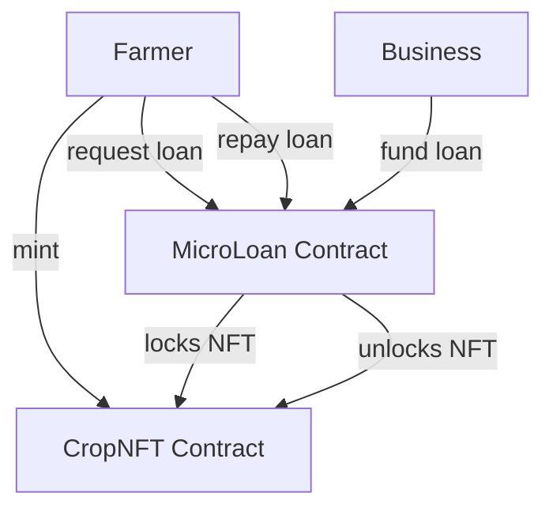

# Microloans with Static NFTs – MVP Plan (Scaffold-ETH 2)

> Time-box: **3 working days**  
> Tech stack: Solidity (0.8.x) + OpenZeppelin, Hardhat, NextJS (App Router) + Scaffold-ETH 2 hooks/components, viem & wagmi, RainbowKit, Hardhat local + Sepolia testnet.

---

## 1 Big-Picture

Farmers mint **static ERC-721 tokens** (representing crop-lots) and pledge them as collateral in a **MicroLoan** contract.  
Local businesses fund the loan in stablecoins (USDT).  
NFT stays locked until farmer repays principal + interest, after which NFT is released.

---

## 2 Contracts (Day 1)

| Contract | Responsibility | Key functions |
| --- | --- | --- |
| **CropNFT** (ERC-721) | Mint/burn static NFTs; URI immutable | `mint(tokenURI)` (only Farmer), `burn(id)` |
| **MicroLoan** | Accept NFT collateral, escrow it, manage loan state, repay & liquidate | `requestLoan(nftId, amount, tokenAddr)`, `fundLoan(loanId)`, `repay(loanId)`, `liquidate(loanId)` |

Design notes:
1. Use `IERC721Receiver` in `MicroLoan` to lock NFTs (`safeTransferFrom`).  
2. Simple linear interest (e.g. fixed 5 %).
3. Single funder per loan (MVP).  
4. Stablecoin = any ERC-20 (use mock USDT on localhost / Sepolia).
5. Emits events: `LoanRequested`, `LoanFunded`, `LoanRepaid`, `LoanLiquidated`.
6. Security: Re-entrancy guards, checks-effects-interactions.
7. Scripts: update `packages/hardhat/deploy/` with `01_deploy_crop_nft.ts`, `02_deploy_microloan.ts`.

### Testing (Hardhat)
- Unit tests for each happy-/edge-case (request, fund, repay, liquidate, failure paths).
- Fork-mainnet token (USDT) for integration if time permits.

---

## 3 Frontend / UX (Day 2)

Pages (NextJS App Router under `packages/nextjs/app/`):

1. `/dashboard` – Overview of user loans (farmer vs. business role auto-detected via NFT ownership / loans funded).
2. `/mint` – Simple form to mint a CropNFT (tokenURI input).
3. `/request-loan` – Select owned NFT, enter loan amount & token; calls `requestLoan`.
4. `/fund` – List of open loan requests; businesses click **Fund**.
5. `/loan/[id]` – Detail view; status component, repay button (farmer), liquidate button (business after expiry).
6. Reuse Scaffold-ETH components: `Address`, `Balance`, `EtherInput` (for ETH if needed), plus custom `ERC20Input`.

Hook patterns:
- Reads: `useScaffoldReadContract`.  
- Writes: `useScaffoldWriteContract`.  
- Events: `useScaffoldWatchContractEvent` for live updates.

State visuals:
- DaisyUI `badge` colours: `Requested`, `Funded`, `Repaid`, `Liquidated`.
- Notification hooks already available.

---

## 4 Integration & Deployment (Day 3)

Tasks:
1. **Wire up** contracts to UI via hooks; ensure Typescript autocompletion by running `yarn deploy` (regenerates `deployedContracts.ts`).
2. Manual QA on Hardhat (`yarn chain`, `yarn deploy`, `yarn start`).
3. Deploy contracts to **Sepolia**: `yarn deploy --network sepolia` (update `scaffold.config.ts` targetNetworks to include `sepolia`).
4. Configure Alchemy / WalletConnect env vars in `packages/nextjs/.env.local`.
5. Build & preview: `yarn build && yarn serve`.
6. Optional Vercel preview (`yarn vercel:yolo`).

---

## 5 Stretch Goals (post-MVP)
- Multiple funders (pool style, NFT fractionalization).
- Variable interest via Dutch auction.
- Dynamic oracle-based NFT valuation.
- Reputation scoring for farmers (on-chain history).
- IPFS metadata upload for CropNFT (photo + details).

---

## 6 Risks & Mitigations
1. **Oracle price volatility** – ignore in MVP; later use Chainlink feeds.  
2. **Default risk** – include liquidation after deadline.  
3. **Stablecoin availability** – use mock ERC-20 for tests.

---

## 7 Deliverables
- Smart contracts + unit tests in `packages/hardhat/`.
- Deployed contract addresses in `deployedContracts.ts` (auto).  
- NextJS frontend pages under `/mint`, `/request-loan`, `/fund`, `/loan/[id]`.
- Demo video & README walk-through.

---

_This file lives at `MICROLOANS_MVP_PLAN.md` and guides the initial proof-of-concept implementation._ 